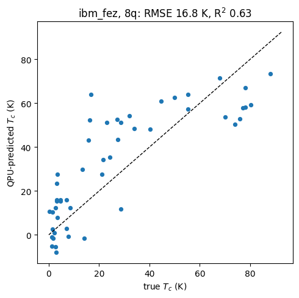
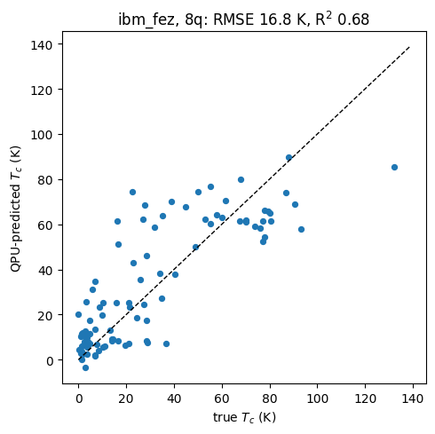
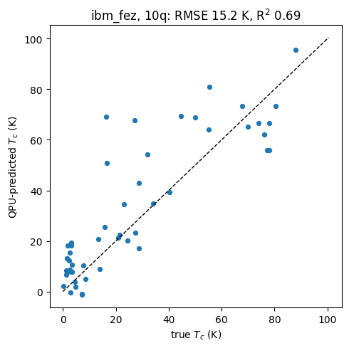
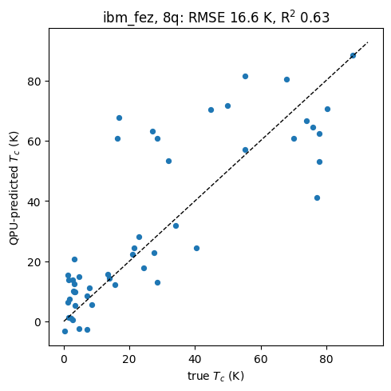

# Results: QNN Tc regression, PCA vs Top-N encodings across qubit counts

The graphs compare two ways of compressing the dataset's 81 material
descriptors into the N input slots a QNN offers (one rotation angle per
qubit). PCA (Principal Component Analysis) is an unsupervised method that
blends all 81 standardized features into N components chosen to preserve the
maximum *variance* of the data; it never looks at the target Tc, so high-variance
but irrelevant information can occupy precious qubit slots. Top-N is
supervised feature selection: we keep the N individual columns that
contribute most to predicting Tc (ranked by XGBoost gain importance, drawn
from the five physically important families: thermal conductivity, atomic
radius, valence, electron affinity, atomic mass) and feed them to the circuit
undiluted. Across every configuration tested, Top-N outperforms PCA at equal
qubit count, because for a model with so few inputs, relevance beats
variance.

In terms of scalability, adding qubits helps in ideal simulation: each extra
qubit admits one more feature and steadily lowers the noiseless
RMSE (e.g. ~21.7 K at 2 qubits down to ~16.9 K at 10 qubits), since more of
the dataset's signal survives the compression bottleneck.

Under realistic noise, however, this scaling breaks down: although we
increased the number of qubits, the accompanying growth in circuit **depth
and two-qubit gate count dominated the error budget and drove the RMSE back
up**, eroding (and eventually outweighing) the information gain from the
richer encoding. Each added layer and entangling brick multiplies exposure to
gate errors, so the noisy curves flatten or invert where the ideal curves keep
improving.

The practical conclusions are therefore twofold: either run on
better hardware (lower two-qubit error rates, e.g. Heron-class devices,
plus error mitigation), or make the circuit itself cheaper for the same
expressivity, via circuit pruning (removing entangling gates between
weakly interacting features), qubit reordering (assigning strongly
interacting features to adjacent qubits so shallow circuits capture their
correlations directly), or rephrasing the ansatz (shallower
hardware-native designs, e.g. fewer re-uploading layers, brickwork instead of
ring entanglement, or two-features-per-qubit encodings that gain information
without gaining depth). In short: on today's devices, hardware-aware circuit
design, not qubit count, is the lever that determines real performance.

Reproduce: [BasQ_hardware_run_8q_3L.ipynb](BasQ_hardware_run_8q_3L.ipynb).
